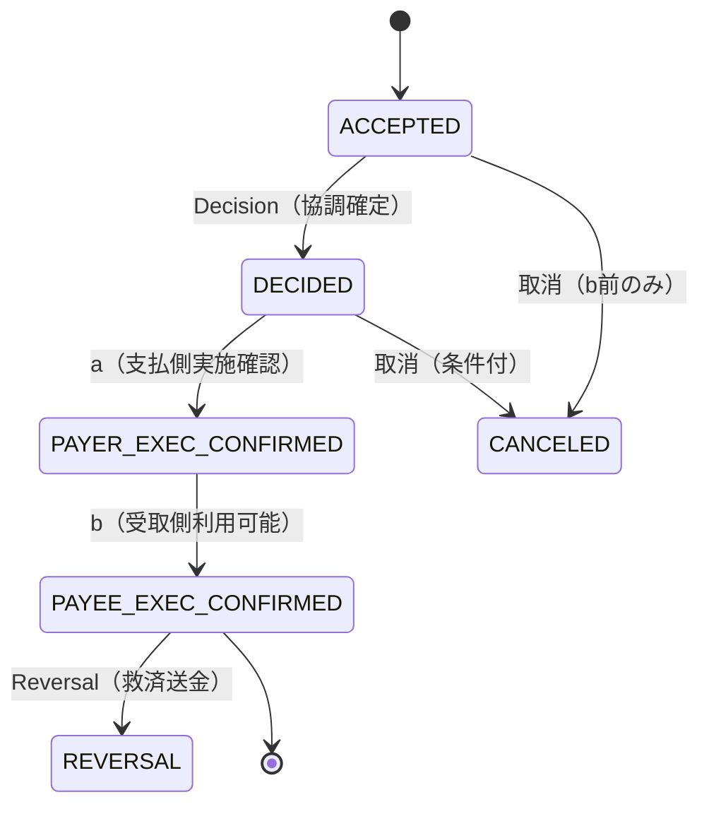
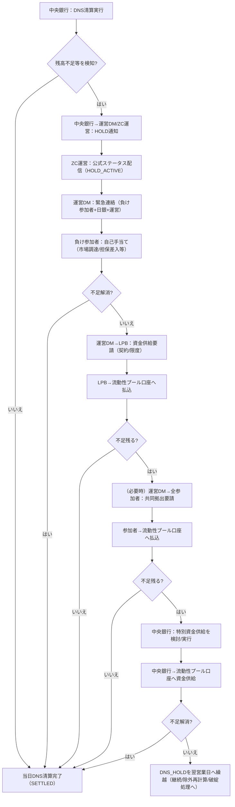
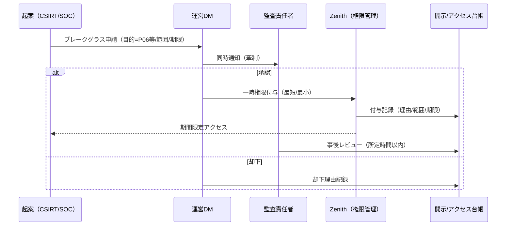
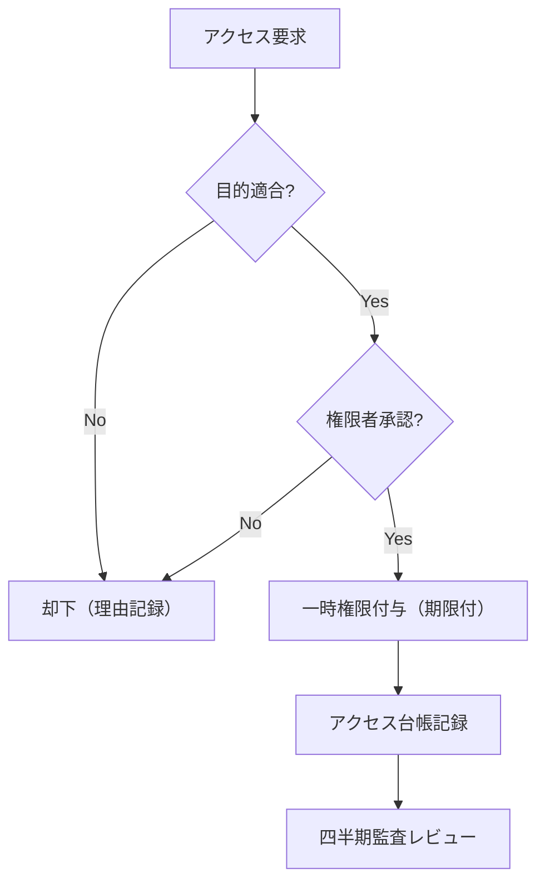

# 制度（規程・ガバナンス）

> <b>要旨</b> 
> 「制度」では、Zenith Coordinator（ZC）の技術設計を前提に、機能設計の背後にある制度的前提を示す。技術仕様の詳細は本文/補遺/付録を正とする。

制度編の章番号は制度内で完結し、本文の第1章〜第15章とは別の番号体系です。

## 1. 制度の基本原則・設計思想（Design Principles）

### 1.1 設計原則
1. **Explainability First** ：状態・理由・証跡が先、機能が後。
2. **Privacy by Design** ：最小化＋アクセス最小化＋監査可能性（後付け禁止）。
3. **Neutrality & Fair Access** ：参入・料金・データで差別禁止。共同事業の「競争制限誤認」を設計で回避。
4. **Operational Feasibility** ：現場が動ける（権限・手順・証跡）を要件の上位に置く。
5. **Resilience as Institution** ：停止/縮退/再開は技術でなく制度（権限・優先順位）で担保。
6. **Backward Compatibility** ：急激な変化より定着。移行可能性を最優先。
7. **No Heroics** ：人が無理をして回す設計を禁止し、例外はCASEとして制度化する。

### 1.2 トレードオフ（意思決定ルール）
| トレードオフ | 優先順位ルール（判断基準） | 禁止事項 |
| --- | --- | --- |
| 即時性 vs リスク統制 | システミック領域は統制優先。即時性は縮退可能性とセットで許容 | 「止められない即時」 |
| 開放性 vs 管理可能性 | 二層参加で両立。接続参加は統制要件を明確化 | 恣意的参入拒否 |
| 透明性 vs プライバシー | 透明性は証跡で、プライバシーは最小アクセスで担保 | フルデータ集約 |

> <b>意思決定の鉄則</b> 
> 原則が衝突する場合は、(1) 公共性（利用者保護・安定性）→(2) 中立性（競争政策）→(3) 運用可能性（現場が回る）→(4) コスト、の順で判断する。

### 1.3 本章の規程要点
- 例外は「運用で吸収」せず、CASEとして制度化する。
- プライバシーは最小化＋監査可能性で担保する。
- 中立性は努力目標ではなく、禁止事項の列挙で担保する。
- 移行可能性を満たさない制度は採用しない。

## 2. 制度仕様（提供機能・ルール要件）

### 2.1 サービス範囲（In/Out）
| 区分 | In（提供する） | Out（提供しない） |
| --- | --- | --- |
| 決済種別 | 振込相当、口座間、請求（RTP）、条件付（HTLC） | 証券決済、現金輸送 |
| 参加形態 | 決済参加者（銀行等）、接続参加者（PSP等） | 無資格者の直接接続 |
| 上限・時間 | 上限・高額連携は別枠で設計 | 無制限即時（統制なし） |

### 2.2 ルールとしての処理要件
- **受付（Acceptance）** ：参加者が顧客指図を受けた時点から、ZCの取引ID（txid/gtid等）を付与し、照会可能とする。
- **取消（Cancel）** ：b（PAYEE_EXEC_CONFIRMED）以前に限定し、所定の条件（誤送信・二重送信等）と証跡（指図取消依頼、相手方同意等）を要する。
- **訂正（Correct）** ：金額・受取人等の本質情報の訂正は「取消＋再指図」を原則とし、訂正単体は原則禁止（混乱防止）。
- **組戻し（Reversal）** ：b以後は「取消」ではなくReversalとして処理する。原則、(a) 受取人同意、(b) 法令・裁判所命令、(c) 当局要請、のいずれかを要件とする。
- **凍結・差押・疑義取引** ：執行主体（参加者）とZCの役割を明確化し、ZCは状態・証跡を提供するが、口座凍結自体は参加者が実行する。

> <b>禁止（誤解防止）</b> 
> 「訂正だけで元取引を上書きする」ことは禁止する。監査・照会・紛争で必ず破綻するため、訂正は取消＋再指図で表現する。

### 2.3 HTLC（条件付き決済）の制度上の位置付け【規範】
HTLCは条件付きの決済予約であり、 **条件成立までファイナリティ（b）は発生しない** 。制度上の取り扱いは以下のとおり固定する。

1. **状態** ：`HTLC_LOCKED` 中は条件未成立であり、取消（Cancel）・失効（Expiry）の対象となる。
2. **資金の取扱い（会計・運用）** ：支払側参加主体は、条件付き留保のための内部勘定（HTLC Escrow相当）を設け、顧客約款上の説明可能性を確保する。
3. **差押・倒産等の第三者権利主張** ：第三者権利主張（差押・凍結・倒産手続等）が到来した場合、参加主体は法令・約款・リーガルオピニオンに従い執行し、ZCは **状態（FREEZE/LEGAL_HOLD）と根拠証跡参照** を提供する（ZCが法的判断を代替しない）。
4. **secretの取扱い** ：ZCは secret 本体を保持せず、`secret_hash` と検証証跡（提示時刻・検証結果・署名参照）のみを保持する。
5. **不正成立時の責任分界** ：secret漏洩等により不正成立が疑われる場合、一次補償は顧客接点主体が担い、提示・管理責任（委任を含む）の所在に従い求償する（詳細は参加者規程）。

### 2.4 GTID（多者協調取引）の制度上の位置付け【規範】
GTIDは複数の決済（leg）を束ねる参照識別子であり、 **法的効果はleg単位** で発生する。制度上、以下を固定する。

1. **性質** ：GTIDは「取引の束」を示す参照番号であり、GTIDそれ自体を独立の法律行為として扱わない。
2. **ファイナリティ** ：各legのファイナリティ（b）は、当該legの `PAYEE_EXEC_CONFIRMED` 成立時に個別に発生する。
3. **会計・運用上の完了日** ：全legがbに到達した日を `gtid_completion_date` とし、会計・対外説明は原則これを用いる（ただしDNS計上はleg単位）。
4. **DNS計上** ：各legは **各legのb成立日のDNSサイクルに個別に計上** する（GTID単位でのネッティング計上は行わない）。
5. **一部遅延・未成立** ：一部legが `PR-GTID-TTL` を超えて未成立の場合、GTIDは `GT_SUSPENDED` とし、(a) 遅延回復、(b) 未成立legに関する補償/救済（成立済みlegは維持）で収束する。
6. **倒産否認等** ：倒産否認等により一部legに遡及的な扱いが発生する場合も、影響は当該legに限定し、他legのbを上書きしない（必要な回収はReversal/法定返還等の別取引で処理）。

### 2.5 DNS（Daily Netting Settlement）とDNS_HOLD時の流動性手当て（制度）

<!-- SoT: 制度 / References: （本文表示は省略） -->

#### 2.5.1 位置づけ（制度側）
- DNSは、当日中に発生した多数の決済（gtid群）を **参加者間のネットポジション** に圧縮して清算する日次サイクルである。
- DNS_HOLDは、ネット債務者（負け参加者）の資金不足等により、当日DNS清算が完了できない状態であり、 **決済の“取消”ではなく、清算完了のための“つなぎ流動性”確保** として扱う。
- DNS_HOLD中の情報開示は、取り付け・風評を誘発しないよう、 **公式ステータス／公式発表に一致** させ、原因行・不足額等は閉域情報とする。

#### 2.5.2 DNS_HOLD時の各主体の動き（制度プロトコル：概要）
- **検知** ：中央銀行（DNS清算サービス）が清算実行時に残高不足等を検知し、運営DM（清算運営）およびZC運営へ通知する。
- **公式状態化** ：ZC運営は `HOLD_ACTIVE` を公式ステータスとして配信し、参加者は顧客向け表示で「取引未完了」と誤認させない。
- **自助努力（優先）** ：負け参加者は市場調達・行内流動性移動・担保差入等で当日解消を試みる。
- **流動性供給銀行（LPB）スキーム** ：自助努力で不足する場合、運営DMは事前契約に基づきLPBへ資金供給を要請し、資金は中央銀行内の **流動性プール口座（特別口座）** へ払い込まれる。
- **共同拠出（必要時）** ：LPB供給でも不足する場合、運営DMは規程に基づき全参加者へ臨時拠出を要請し、同じ流動性プール口座へ払い込まれる。
- **日銀の資金供給（必要時）** ：なお不足する場合、中央銀行は（必要に応じて当局と協議のうえ）日銀法等に基づく特別な資金供給を検討し、実行する場合は同じ流動性プール口座へ資金を投入する。
- **当日解消不能** ：当日中に不足が解消できない場合、DNS_HOLDは翌営業日へ繰り越され、清算の継続／参加停止／除外再計算等の措置に接続する（詳細は本文 4.4（DNS HOLD）に委ねる）。

> <b>注記：制度編と本文（ZC設計書）の分業</b> 
> 本節は「制度として、誰が何を行うか（責任分界・発動順序・情報統制）」を固定する。 
> 清算対象セットの凍結（スナップショット）、イベント/照会I/F、資金源の監査証跡などの技術仕様は、本文 4.4（DNS HOLD）に規定する。

#### 2.5.3 流動性リスク管理（定量要件：規程で固定）
- **目的** ：DNSは流動性効率化のための仕組みである一方、DNS_HOLDは市場混乱（風評・取り付け）や連鎖破綻を誘発し得るため、 **事前に「必要流動性」「調達手段」「発動閾値」を定量で固定** する。
- **最低カバレッジ（検討案）** ：
  - 通常時： **最大ネット債務者（Largest Net Debit Participant）の不足額** を、LPBコミットメント＋共同拠出コミットメントでカバー。
  - 緊急時：上記に加え、 **第2位のネット債務者の一定割合（PR-LIQ-COVER2_FACTOR=一定割合）** を加算し、短時間で調達可能な手段（担保差入・当日資金移動）を含めてカバー。
- **早期警戒指標（EWI）** ：
  - 参加者別：DNS想定ネット債務の増分、担保余力、当日資金繰りの逼迫指標（社内指標で可）
  - システム側：HOLD発生回数、解消までの平均時間、LPB発動回数、共同拠出発動回数
- **ストレステスト** ：月次（標準シナリオ）＋年次（危機シナリオ）。合格基準（規程値：当日解消率≥所定水準、最大解消時間≤所定時間）を固定し、未達時は料金・参加要件・上限（H）を見直す。

#### 2.5.4 翌日繰越と参加者デフォルト管理への接続
- 当日中に解消できない場合、DNSは翌営業日に持ち越される。
- ただし、持ち越しは無限に許容せず、 **所定の時間・回数** で「参加者デフォルト管理（除外再計算／参加停止／破綻処理）」へ必ず接続する。

### 2.6 本章の規程要点
- サービス範囲をIn/Outで明確化し、スコープ膨張を禁止する。
- 取消はb以前に限定する。
- 訂正単体は禁止し、取消＋再指図を原則とする。
- b以後はReversalのみ。
- 凍結・差押は口座管理主体（参加者）が実行し、ZCは状態と証跡で支える。

## 3. 制度運営プロセス設計（Governance in Action）

### 3.1 DNS_HOLD時の初動連絡・公表統制・顧客表示【規範】

DNS_HOLDは風評・資金繰り・取り付けを誘発し得るため、初動連絡と対外表示を規範として固定する。Public v2では、分単位の期限やパラメータ名は公開せず、 **統制の骨格** を示す。

1. **初動連絡（閉域）** ：DNS_HOLDを宣言した場合、ZC運営は **所定時間内** に当局（監督当局・中央銀行）へ閉域通知し、同様に **所定時間内** に当事者へ通知する。
2. **全参加者通知（閉域）** ：全参加者へ公式ステータス通知を行う。ただし原因行の特定情報・不足額等の定量情報は閉域の必要者に限定する（ABAC＋監査ログ）。
3. **公表（公開層）** ：公表が必要な場合、ZCは当局と協議のうえ **所定期間内** に第1報を公表する。公表文は事前承認テンプレ（`public_message_id`）に限定する。
4. **禁止表現（参加者の顧客表示）** ：参加者の顧客向け表示は `public_message_id` に対応する定型文、または規程で承認された表現に限定し、次を禁止する：
  - (a) 特定参加主体名の明示（当該主体が自ら公表する場合を除く）
  - (b) 不足額・負債比率等の定量情報
  - (c) 「破綻」「倒産」等の断定表現
### 3.2 データガバナンス（最小化＋監査可能性）
ZCは口座情報や氏名住所等のPIIを保持しない。保持するのは「協調に必要な最小データ」と「説明可能性のための証跡」に限る。

#### 3.2.1 データ最小化カタログ
| データ項目 | 用途（目的限定） | 保存形態 | 保全/保持期間 | 主な閲覧権限 |
| --- | --- | --- | --- | --- |
| txid/gtid/leg_id | 追跡・相関 | 平文ID | 10年 | 参加者（当事者）、当局、監査 |
| 参加者ID（payer/payee） | ルーティング・責任分界 | 平文 | 10年 | 参加者（当事者）、当局、監査 |
| 金額・通貨 | 決済/補償算定 | 平文 | 10年 | 参加者（当事者）、当局、監査 |
| 状態遷移（a/b等） | 説明・監査 | Finality Log | 10年（WORM） | 当局、監査、当事者（限定） |
| 顧客識別子（参加者内ID） | 当事者照会の接続 | **ハッシュ（ソルト付）** | 5年 | 当事者参加者（照合のみ） |
| 端末/接続メタ（IP等） | 不正検知 | マスク＋集計 | 2年 | SOC/CSIRT、監査 |
| 署名/証跡参照（proof_ref） | 証憑整合 | 参照IDのみ | 10年 | 当局、監査 |
| CASE分類/期限/担当 | 例外処理 | CASE台帳 | 10年 | 当局、監査、当事者参加者 |

> <b>禁止（後付け収集）</b> 
> 「便利そうだから」という理由でデータ項目を追加してはならない。データ追加は留保事項とし、目的・保持期間・アクセス権の更新をセットで決議する。

#### 3.2.2 アクセス制御と監査
| ロール | 参照できるデータ | できないこと | 監査方法 |
| --- | --- | --- | --- |
| 参加者運用 | 自社当事者の状態・CASE | 他参加者の顧客情報 | アクセス台帳（月次） |
| 参加者法務/コンプラ | 自社当事者の証跡・開示記録 | 全件検索 | 監査レビュー（四半期） |
| 運営SOC/CSIRT | メタ情報・検知データ | 顧客識別子の復元 | SIEM監査（常時） |
| 監査 | 監査範囲の全データ | 目的外利用 | 監査ログ＋現場検証 |
| 当局 | 法令に基づく必要最小限 | 網羅取得の恒常化 | 開示台帳＋事後レビュー |

##### 3.2.2.1 利用目的コード（Purpose Codes）
アクセス要求は必ず『利用目的コード』を付与し、目的に応じて最小のデータ範囲・最小の期間で付与する。

| 目的コード | 目的 | 起案主体 | 承認者（原則） | 参照範囲（最小） | 監査証跡 |
| --- | --- | --- | --- | --- | --- |
| P01 | 自社取引の状態照会（顧客対応） | 参加者CS | 参加者責任者 | 自社当事者のみ | 開示台帳/アクセスログ |
| P02 | CASE処理（取消・訂正・Reversal） | 参加者運用 | 参加者責任者 | CASE対象のみ | CASE台帳/操作ログ |
| P03 | 不正・詐欺の一次遮断（Kill-Switch） | 参加者SOC | 参加者SOC責任者 | 疑義対象のみ | 遮断ログ/判断根拠 |
| P04 | 監査（年次・テーマ） | 監査 | 監査責任者 | 監査対象期間 | 監査計画/閲覧履歴 |
| P05 | 当局照会（法令根拠あり） | 当局 | 参加者法務/運営法務 | 照会対象のみ | 開示台帳/命令書 |
| P06 | 障害解析 | 運営CSIRT | 運営DM＋監査 | 事故範囲のみ | インシデント記録 |
| P07 | 基金支払・求償（補償レベル表：別紙） | Fund Administrator/運営 | Fund Administrator社長＋本会 | 当該事故のみ | 支払台帳/決裁記録 |

> <b>禁止事項（データ濫用の防止）</b> 
> 目的コードのないアクセス、横断的な顧客プロファイリング、網羅取得の恒常化、外部持ち出しを禁止する。 
> 違反は重大コンプライアンス違反として直ちにアクセス停止とする。

###### 3.2.2.1.1 利用目的コードの監査ログ・違反検知（リアルタイム遮断＋事後追試）【規範】
ZCは、目的コード（P01〜P07）を **単なるラベル** にせず、監査で追試できる形で固定する。

1. **監査ログ（shall）** ：すべてのデータアクセスについて、最低限以下を Access Audit Log に記録する：
  - アクセス主体（org_id / system_id / user_id）
  - 目的コード（purpose_code）および承認者（purpose_approved_by）
  - 対象範囲（txid/gtid/期間/参加主体）
  - 時刻（RFC3339）、判定（permit/deny）、理由コード
  - エクスポート時は `export_ref` を必須

2. **リアルタイム遮断（must block）** ：以下は自動遮断し、`DataAccessViolationDetected` を起票する。
  - 目的コードなし／承認者なし
  - 全件検索・ランキング・相関探索などの禁止クエリパターン（ルールセットは変更管理対象）

3. **事後監査（must detect）** ：以下は事後監査で検知し、CASEへ自動昇格する。
  - 同一主体による複数参加主体への横断的突合の疑い
  - 目的外流用（P01取得データを別目的に再利用等）
  - エクスポート後の持出管理逸脱（期限超過・WORM未保全等）

4. **通知（T+24h）** ：重大違反は当局・本会・監査責任者へ `PR-DATA-VIOLATION_NOTIFY_TTL` 以内に通知する。
##### 3.2.2.2 ブレークグラス（緊急アクセス）
緊急アクセスは、顧客影響のある障害と重大不正の対応に限定し、期限付与・事後審査を必須とする。

##### 3.2.2.3 取得制限とエクスポート統制
- **検索制限** ：全件検索・ランキング・相関探索は不可。照会は取引ID/CASE ID/当事者キーに限定する。
- **エクスポート制限** ：CSV等の一括出力は原則禁止。監査目的のみ例外とし、WORM保全＋持出管理を必須とする。
- **期限・回収** ：付与権限は最長所定時間。失効後の再付与は再申請とする。

### 3.3 証跡保全（WORM）と第三者保証の接続
- Finality Logと開示台帳、基金支払台帳はWORM相当で保全し、改ざん検知を必須とする。
- 監査は「WORMが機能していること（整合性）」を年次でレビューする。
